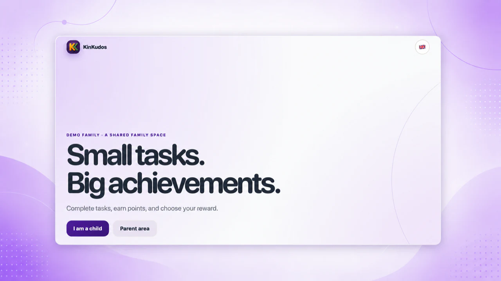
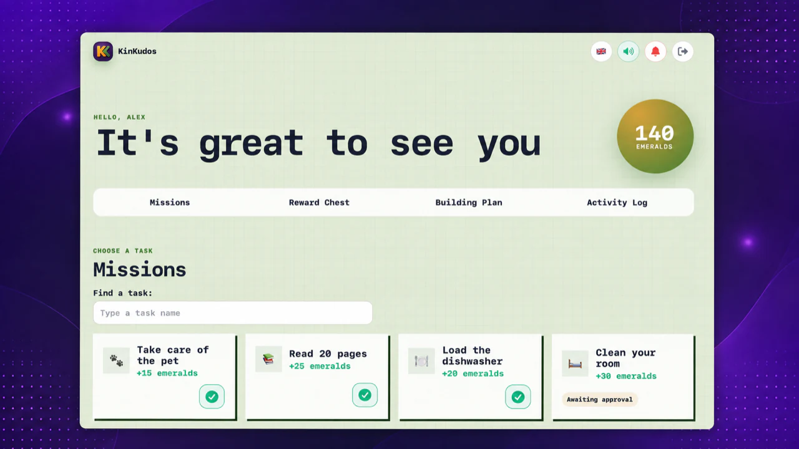
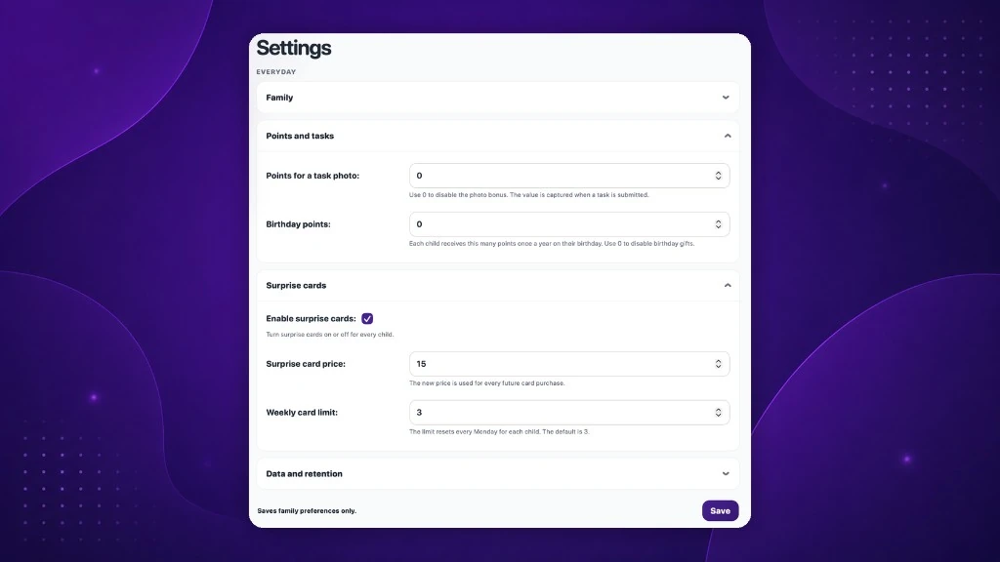
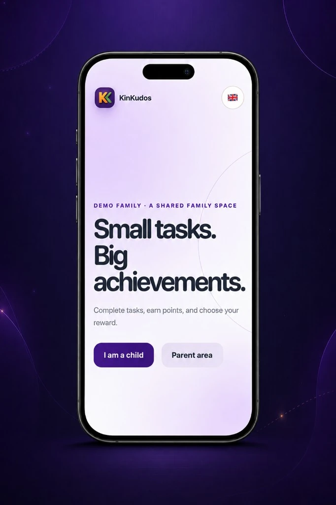
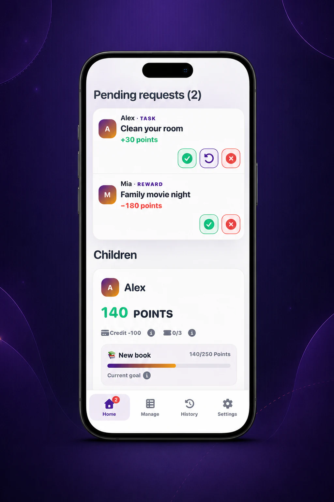
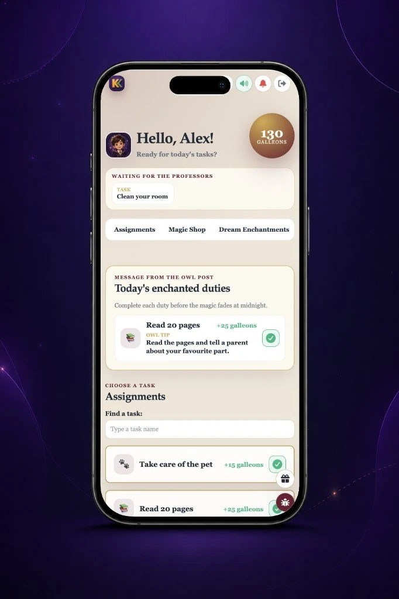
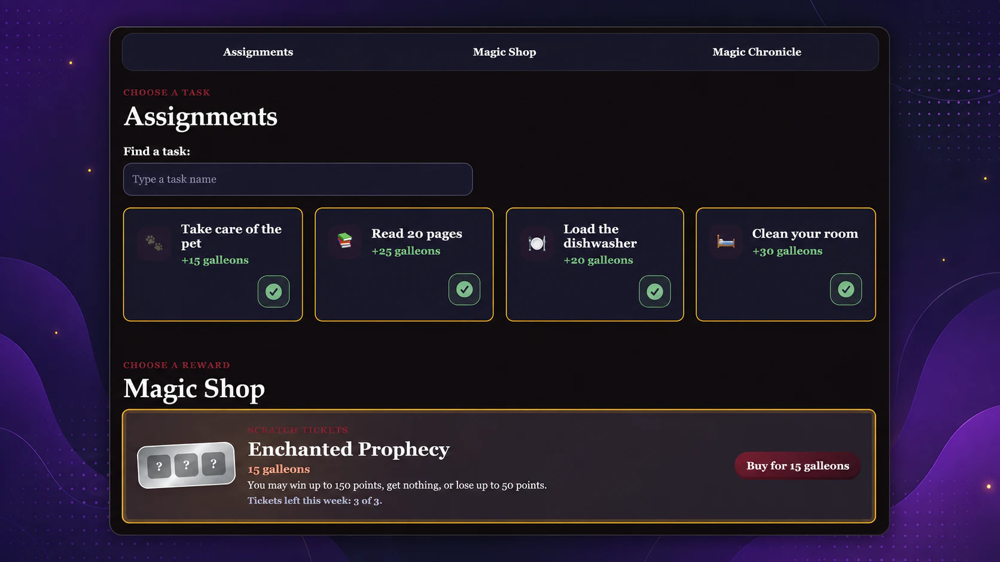

# KinKudos

<p align="center">
  <strong>Privati, savarankiškai diegiama šeimos programa darbams, taškams, tikslams ir prizams.</strong><br>
  Paverskite kasdienius šeimos darbus matoma pažanga. Vaikai mato, ką daryti, ir siekia
  prizų, o tėvai peržiūri pažangą bei užtikrina aiškias ir sąžiningas taisykles. KinKudos
  veikia jūsų pasirinktoje ir administruojamoje infrastruktūroje, todėl jūs sprendžiate,
  kur saugomi šeimos duomenys.
</p>

<p align="center">
  <a href="https://demo.kinkudos.app/"><strong>🚀 Išbandyti demonstraciją</strong></a> ·
  <a href="https://docs.kinkudos.app/index.lt/">📚 Dokumentacija</a> ·
  <a href="https://kinkudos.app/">🌐 Svetainė</a> ·
  <a href="https://github.com/VooZ2/kinkudos/releases">📦 Naujausias leidimas</a> ·
  <a href="README.md">🇬🇧 In English</a>
</p>

<p align="center">
  <a href="https://github.com/VooZ2/kinkudos/releases"></a>
  <a href="https://hub.docker.com/r/vooz2/kinkudos"></a>
  <a href="LICENSE"></a>
</p>

## ✨ Kaip tai atrodo

<table>
  <tr>
    <td width="50%" valign="top">
      
      <p align="center"><sub><strong>Pradžia</strong><br>Paprasta pradžia vaikams ir tėvams.</sub></p>
    </td>
    <td width="50%" valign="top">
      
      <p align="center"><sub><strong>Vaiko misijos</strong><br>Darbai, teminiai taškai, prizai ir matoma pažanga.</sub></p>
    </td>
  </tr>
  <tr>
    <td colspan="2">
      
      <p align="center"><sub><strong>Tėvų valdymas</strong><br>Tėvai tvarko šeimos taisykles, taškus, nutrinamus bilietus ir kitus nustatymus.</sub></p>
    </td>
  </tr>
</table>

<p align="center">
  
  
  
</p>
<p align="center"><sub>Patogiai naudokite KinKudos telefone, planšetėje ar kompiuteryje.</sub></p>

<p align="center">
  
</p>
<p align="center"><sub><strong>Savas pasaulis</strong><br>Vaikai gali pasirinkti vaizdinę temą su savais tekstais ir taškų vienetais.</sub></p>

*Ekrano nuotraukose naudojami išgalvoti demonstraciniai duomenys.*

## 🔄 Kaip tai veikia

1. 📝 Tėvai sukuria ar paskiria darbą.
2. ✅ Vaikas jį atlieka ir pateikia rezultatą.
3. 👀 Tėvai peržiūri ir patvirtina darbą.
4. 🎯 Vaikas gauna taškų bei artėja prie prizo ar taupymo tikslo.

## 💜 Kodėl KinKudos?

### 👨‍👩‍👧‍👦 Aišku tėvams

Laikykite darbus, patvirtinimus, taškus ir prizus vienoje vietoje, išsaugodami šeimos taisyklių bei galutinių sprendimų kontrolę.

### 🎮 Matoma pažanga vaikams

Vaikai gali matyti savo darbus, rinkti teminius taškus, prašyti prizų ir taupyti ilgalaikiams tikslams.

### 🔒 Privatumas pagal numatymą

Viena instaliacija skirta vienam namų ūkiui. Nėra viešos registracijos, reklamų, profiliavimo ar programoje integruotos analitikos.

### 🏠 Jūsų kontrolė

Paleiskite KinKudos savo namų serveryje ar VPS ir nuspręskite, kur saugomi šeimos duomenys.

## 🎯 Ką gali šeima

### 👨‍👩‍👧 Šeimos eiga

- Darbai, dienos paskyrimai ir tėvų patvirtinimai
- Prizai, taupymo tikslai, taškų dovanos ir gimtadienio taškai
- Vaikų pasiūlymai ir tėvų sprendimai
- Taškų korekcijos, nuobaudos ir konfigūruojamas kreditas
- Matoma taškų istorija

### 🎨 Vaiko patirtis

- Septynios originalios vaizdinės temos su savais tekstais, garsais ir taškų vienetais
- Vaikams pritaikytas prisijungimas PIN iš susieto naršyklės lango ar PWA
- Pasirenkami garsai ir „Web Push“ pranešimai
- Pasirenkami tėvų kontroliuojami nutrinami bilietai

### 🔐 Privatumas ir kontrolė

- Viena šeima vienoje instaliacijoje
- Nėra viešos registracijos, reklamų, profiliavimo ar integruotos analitikos
- Įkeltos darbų nuotraukos sumažinamos, konvertuojamos į WebP ir išvalomos nuo EXIF metaduomenų
- Pasirenkamos šifruotos nuotolinės kopijos
- Lietuvių ir anglų sąsajos

## 🏡 Sukurta šeimos kasdienybei

KinKudos nėra darbo užduočių programa, pritaikyta vaikams. Ji sukurta tikroms šeimos rutinoms: paprastiems darbams, tėvų patvirtinimui, matomai pažangai, teminiams taškams, prizams ir ilgalaikiams tikslams.

## ✅ Ar KinKudos tinka jūsų šeimai?

### Tinka, jei

- norite vienos privačios erdvės vienam namų ūkiui;
- jau turite namų serverį ar VPS arba norite jį susikonfigūruoti;
- kas nors gali prižiūrėti Docker, atnaujinimus, HTTPS ir kopijas;
- vertinate kontrolę labiau nei prenumeruojamą paslaugą.

### Tikriausiai netinka, jei

- norite užsiregistruoti ir pradėti be serverio paruošimo;
- vienoje instaliacijoje reikia kelių nesusijusių šeimų;
- tikitės komercinio palaikymo ar paslaugų lygio sutarties;
- reikia vietos stebėjimo, tėvų sekimo ar bankinių funkcijų.

Prieš diegdami perskaitykite, [ar KinKudos tinka jūsų šeimai](https://docs.kinkudos.app/start/is-kinkudos-right.lt/), ir peržiūrėkite [KinKudos dokumentaciją](https://docs.kinkudos.app/index.lt/).

## 🚀 Išbandykite demonstraciją

Susipažinkite su tėvų ir vaikų eiga nieko nediegdami:

- **Demonstracija:** [demo.kinkudos.app](https://demo.kinkudos.app/)
- **Tėvų vartotojo vardas:** `demo`
- **Tėvų slaptažodis:** `demo`
- **Vaiko PIN:** `1234`

Viešoje demonstracijoje naudojami išgalvoti duomenys; ji atkuriama kas valandą, todėl galite drąsiai išbandyti.

## 🐳 Įdiekite KinKudos serveryje

KinKudos veikia AMD64 ir ARM64 „Linux“ serveriuose su „Docker Engine“ ir „Docker Compose“ papildiniu. Taip pat reikės pagrindinio kompiuterio vardo arba domeno, HTTPS per Caddy, Nginx ar Traefik reverse proxy ir bazinių „Linux“ bei Docker administravimo įgūdžių.

Naujame serveryje, kuriame jau veikia „Docker Engine“ ir „Docker Compose“:

```bash
curl -fsSL https://kinkudos.app/install.sh -o /tmp/kinkudos-install.sh \
  && sh /tmp/kinkudos-install.sh
```

Vedlys parsisiunčia naujausią KinKudos leidimą, patikrina jo SHA256 kontrolinę sumą, sukuria reikiamus programos katalogus ir konfigūraciją bei paleidžia KinKudos su Docker Compose. Pirmoji šeima ir tėvų administratorius tada saugiai sukuriami naršyklėje; neprivalomą SMTP galima praleisti ir nustatyti vėliau. CLI lieka atkūrimo bei pažangiam administravimui.

Komanda skirta **naujai instaliacijai**. Esamas instaliacijas būtina atnaujinti pagal dokumentuotą procesą.

### Rankinis Docker Compose diegimas

Jei naudojate nestandartinį ar jau valdomą serverį, naudokite oficialius leidimo
failus iš [`deploy/` katalogo](deploy/). Pradėkite nuo jame esančio
`compose.yml`, o ne nuo atskiros Compose ištraukos.

Tai nėra pirmo diegimo komanda. Compose failas prijungia paslaptis iš serverio
`../secrets/` katalogo, o Docker Compose pats šių failų nesugeneruoja. Prieš
paruošdami turėkite domeną, HTTPS, tinkamai sukonfigūruotą proxy ir
reikiamus aplinkos kintamuosius. Naujoje diegimo šaknyje pirmiausia, ne root
naudotoju, ją paruoškite:

```bash
cd /opt/kinkudos/deploy
./bootstrap.sh
```

Paruošimo scenarijus sukuria nuolatinius katalogus, sugeneruoja Django, VAPID,
setup, atsarginių kopijų agento ir restic paslaptis, sukuria vietinį proxy
papildinį ir paleidžia paslaugas. Išjungus SMTP jis taip pat sukuria tuščią
`smtp_password` failą. Tik paruoštam diegimui vėliau naudokite paprastą Compose
paleidimą:

```bash
docker compose up -d --pull always
```

Nuspėjamam diegimui `compose.yml` palikite konkrečios išleistos versijos
atvaizdą:

```yaml
image: vooz2/kinkudos:<version>
```

👉 **[Pasirinkite diegimo būdą](https://docs.kinkudos.app/installation/index.lt/)**

Dokumentacijoje taip pat aprašomi HTTPS, atnaujinimai, kopijos, atkūrimas, diagnostika ir problemų sprendimas.

### ☁️ Neturite namų serverio?

Nedidelis Docker tinkamas VPS dažnai yra vienas paprastesnių būdų privačiai naudoti KinKudos internete. Tinka bet kuris tinkamas VPS tiekėjas; „Hostinger VPS“ yra viena galimybė šeimoms, kurios renkasi komercinę paslaugą.

<p>
  <a href="https://www.hostinger.com/vps/docker-hosting?compose_url=https://raw.githubusercontent.com/VooZ2/kinkudos/main/deploy/hostinger/compose.yaml&REFERRALCODE=LKIGEDIMICSU#pricing">
    
  </a>
</p>

> **Referral pasiūlymas:** Nuoroda gali suteikti nuolaidą ar kitą naudą tinkamoms Hostinger paslaugoms, priklausomai nuo tuo metu galiojančio pasiūlymo. Aš taip pat galiu gauti komisinį, tačiau Jums tai papildomai nekainuoja. Hostinger nėra būtinas KinKudos naudojimui ir nėra oficialus KinKudos partneris.

Nuoroda atveria Hostinger Docker VPS pasirinkimą ir perduoda KinKudos Compose URL į Docker Manager. Pasirinkę VPS pateikite savo domeną bei privatų setup kodą, o pirmąjį šeimos nustatymą užbaikite naršyklėje. Vadovaukitės [Hostinger VPS instrukcija](https://docs.kinkudos.app/installation/hostinger.lt/). Hostinger yra mokama išorinė paslauga, o KinKudos išlieka nemokama ir savarankiškai diegiama.

## ⚙️ Architektūra

- Django 5.2
- Serverio generuojamas HTML
- Vanilla JavaScript PWA
- SQLite WAL režimu
- Gunicorn ir WhiteNoise
- Docker
- „Web Push“ su VAPID

Įprastam naudojimui nereikia Node.js, SPA karkaso ar viešo API.

## 🛡️ Saugumas ir privatumas

KinKudos sukurta kaip privati erdvė vienam namų ūkiui. Tėvų slaptažodžiai ir vaikų PIN yra ribojami pagal bandymus, taškų pakeitimai transakciniai ir įrašomi į matomą istoriją, o šeimos duomenys, darbų nuotraukos, duomenų bazės, kopijos ir prisijungimo duomenys nelaikomi viešoje repozitorijoje. Programa neturi reklamų, profiliavimo, integruotos analitikos ar KinKudos valdomos šeimos duomenų debesijos.

Savarankiškas diegimas suteikia kontrolę, bet atsakomybė už HTTPS, serverio saugumą, atnaujinimus ir patikrintas kopijas lieka jums. Apie saugumo pažeidžiamumus ir palaikymo apimtį skaitykite [SECURITY.md](SECURITY.md). Nepataisytus pažeidžiamumus praneškite privačiai, niekada ne viešame GitHub Issue.

## 📚 Dokumentacija

Visa dokumentacija pateikiama [docs.kinkudos.app](https://docs.kinkudos.app/index.lt/).

- [Kas yra KinKudos?](https://docs.kinkudos.app/start/what-is-kinkudos.lt/)
- [Ar KinKudos tinka mano šeimai?](https://docs.kinkudos.app/start/is-kinkudos-right.lt/)
- [Pirmos 15 minučių](https://docs.kinkudos.app/start/first-15-minutes.lt/)
- [Pasirinkti diegimo būdą](https://docs.kinkudos.app/installation/index.lt/)
- [Įdiegti Hostinger VPS](https://docs.kinkudos.app/installation/hostinger.lt/)
- [Vedamas serverio installeris](https://docs.kinkudos.app/installation/guided-installer.lt/)
- [Diegimas su Docker Compose](https://docs.kinkudos.app/installation/docker-compose.lt/)
- [Pirmasis setup naršyklėje](https://docs.kinkudos.app/installation/first-time-setup.lt/)
- [Atnaujinimas ir kopijos](https://docs.kinkudos.app/installation/updating.lt/)
- [Problemų sprendimas ir CLI](https://docs.kinkudos.app/troubleshooting.lt/)

## 📌 Projekto būsena ir palaikymas

KinKudos aktyviai prižiūrima ir naudojama tikrame namų ūkyje. Palaikymas teikiamas pagal galimybes, be SLA ar garantuoto atsakymo laiko; palaikomas tik naujausias paskelbtas leidimas.

- [Naujausi leidimai](https://github.com/VooZ2/kinkudos/releases)
- [Pakeitimų istorija](CHANGELOG.lt.md)
- [KinKudos dokumentacija](https://docs.kinkudos.app/index.lt/)

## 🧑‍💻 Vietinis kūrimas

Reikalingas Python 3.12. Sukūrus virtualią aplinką ir įdiegus `requirements.txt`:

```bash
python scripts/compile_translations.py
python manage.py migrate
python manage.py test economy.tests
python manage.py runserver
```

Komanda `seed_demo` skirta tik kūrimui ir atsisako keisti netuščią duomenų bazę. Prieš keisdami autentifikavimą, teises, taškų apskaitą, kopijas ar diegimo logiką perskaitykite repozitorijos dokumentaciją ir esamus testus.

## 🤝 Prisidėjimas ir atsiliepimai

Laukiami klaidų pranešimai, dokumentacijos pataisymai, vertimai ir tikslinės pull request. Didesnius pakeitimus pirmiausia aptarkite Issue.

- [Ieškoti arba atidaryti GitHub Issue](https://github.com/VooZ2/kinkudos/issues)
- [Skaityti pakeitimų istoriją](CHANGELOG.lt.md)
- [Pranešti apie saugumo problemas privačiai](SECURITY.md)

Programos atsiliepimų forma siunčia atsiliepimą konkrečios KinKudos instaliacijos administratoriui, o ne projekto prižiūrėtojui. GitHub Issue niekada neskelbkite slaptažodžių, raktų, privačių šeimos nuotraukų, duomenų bazių, kopijų, asmeninių duomenų ar neredaguotų žurnalų.

## ☕ Palaikykite KinKudos

KinKudos yra nemokama atvirojo kodo programa. Jei ji naudinga jūsų šeimai, galite palaikyti tolesnę priežiūrą vienkartiniu kavos puodeliu. Parama padeda apmokėti domeną, viešą demonstraciją, dokumentaciją, testavimą ir kitą projekto infrastruktūrą, tačiau nesuteikia prioritetinio palaikymo ar garantuotų funkcijų.

<p>
  <a href="https://buymeacoffee.com/vooz2">
    
  </a>
</p>

## 📄 Licencija

KinKudos yra atvirojo kodo programa, platinama pagal [MIT licenciją](LICENSE). Programa pateikiama tokia, kokia yra, be jokių garantijų.
