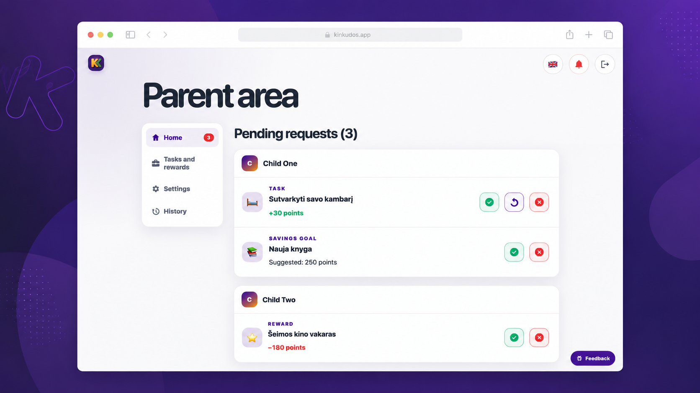
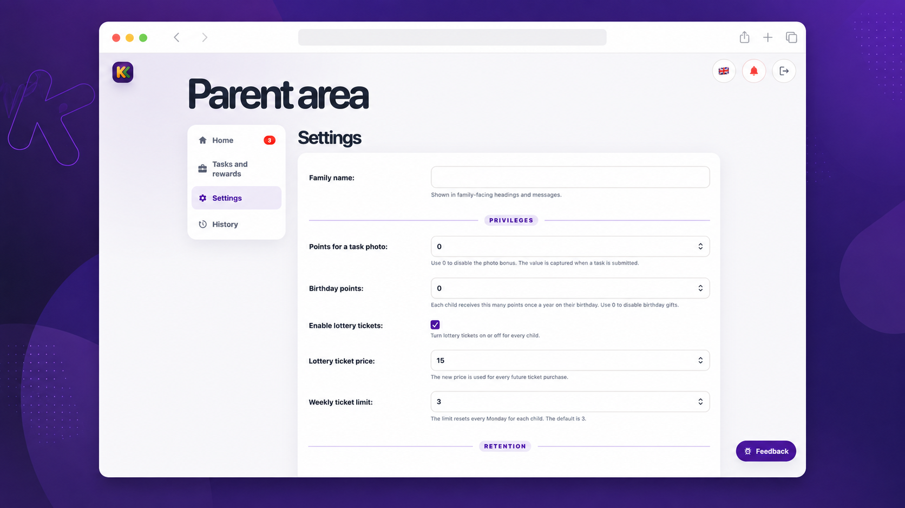
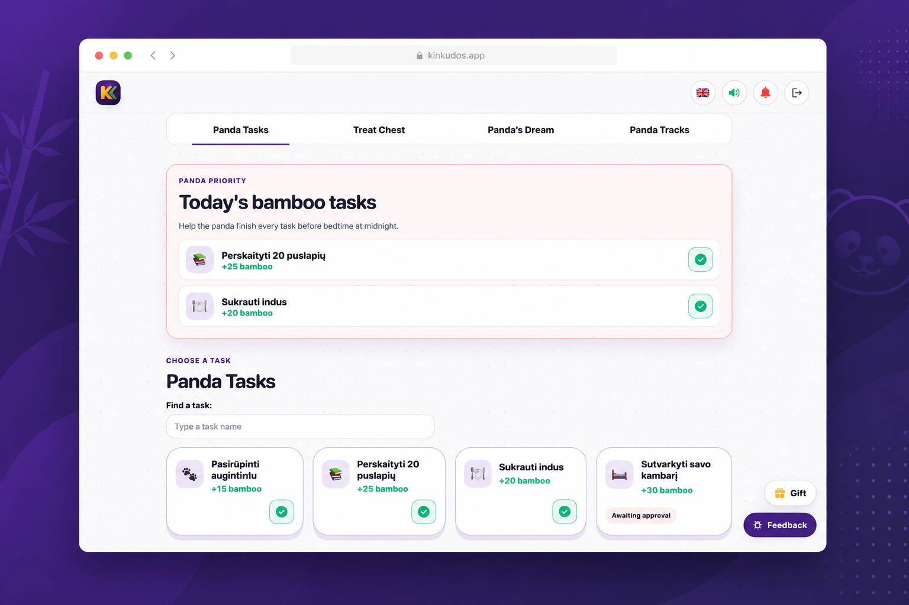
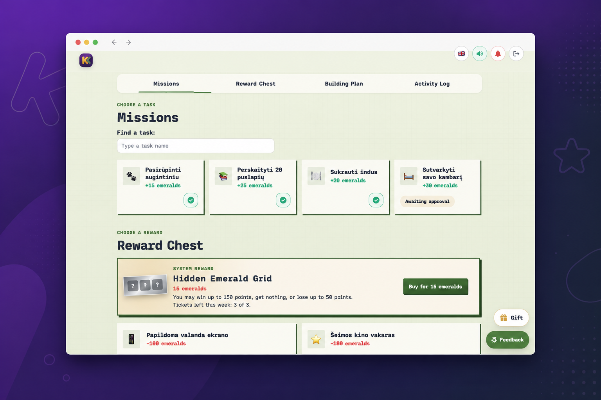
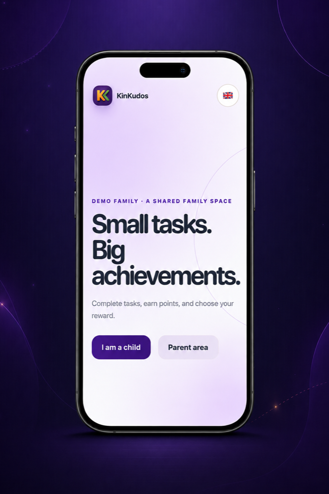
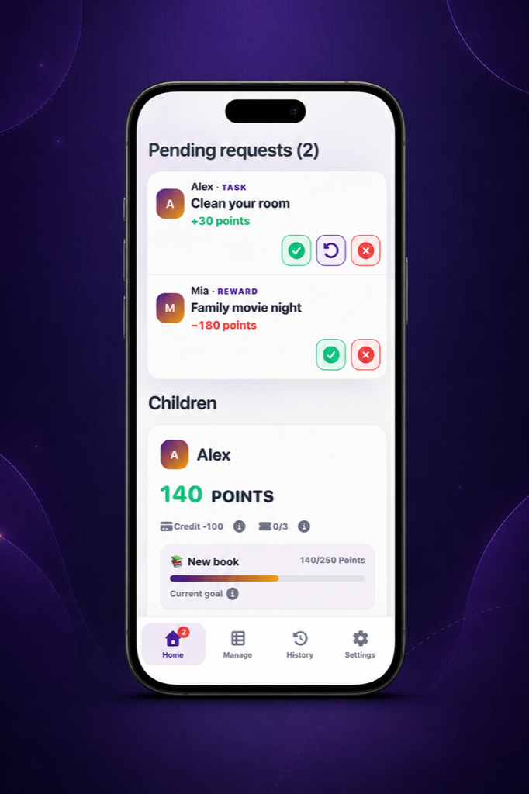

# KinKudos

<p align="center">
  <strong>Turn everyday family tasks into shared progress.</strong><br>
  A private, self-hosted app where children complete tasks, earn themed points,
  and choose rewards — while parents keep everything simple and fair.
</p>

<p align="center">
  <a href="https://demo.kinkudos.app/"><strong>🚀 Try the live demo</strong></a>
  ·
  <a href="https://kinkudos.app/">🌐 Visit the website</a>
  ·
  <a href="README.lt.md">🇱🇹 Lietuviškai</a>
</p>

<p align="center">
  <a href="LICENSE"></a>
  <a href="https://github.com/VooZ2/kinkudos/releases"></a>
</p>
<p align="center"><sub>Current release: 26.4.9</sub></p>

---

## ✨ See it in action

<table>
  <tr>
    <td width="50%"></td>
    <td width="50%"></td>
  </tr>
  <tr>
    <td align="center"><sub><strong>Parent dashboard</strong><br>Review requests and make decisions in one place.</sub></td>
    <td align="center"><sub><strong>Family controls</strong><br>Manage rewards, lottery settings, privacy, and services.</sub></td>
  </tr>
</table>

<table>
  <tr>
    <td width="50%"></td>
    <td width="50%"></td>
  </tr>
  <tr>
    <td align="center"><sub><strong>A world of their own</strong><br>Children can choose themes that make progress feel personal.</sub></td>
    <td align="center"><sub><strong>Tasks, rewards, and goals</strong><br>Everyday routines become clear missions and visible progress.</sub></td>
  </tr>
</table>

<p align="center">
  
  
</p>
<p align="center"><sub>Install KinKudos as a PWA and keep family life moving from any phone or tablet.</sub></p>

Screenshots use fictional demonstration data.

## 🚀 Try the demo

Explore KinKudos without installing anything:

- **Demo:** [demo.kinkudos.app](https://demo.kinkudos.app/)
- **Parent account:** `demo` / `demo`
- **Child PIN:** `1234`

The public demo resets regularly, so you can experiment freely.

## 🎯 What families can do

- ✅ **Turn chores into progress** — children choose or receive tasks, submit work, and parents approve it.
- 🎨 **Make it feel personal** — seven original child themes with their own visuals, wording, sounds, and point units.
- 🎁 **Build healthy reward habits** — rewards, savings goals, gifts, birthday awards, and parent-approved proposals.
- 🎟️ **Add a little surprise** — optional scratch lottery tickets with transparent odds, limits, and parent controls.
- 📷 **Share private photo evidence** — photos are resized, converted to WebP, and stripped of EXIF metadata before storage.
- 🔔 **Stay in sync** — optional Web Push notifications for decisions, requests, assignments, and reminders.
- 📱 **Use it anywhere at home** — installable as a PWA on phones, tablets, and desktops.
- 🌍 **Choose your language** — English and Lithuanian are included throughout the parent and child experience.
- 🔐 **Keep family data private** — one installation serves one family; there are no ads or built-in analytics.

## 🛡️ Built for a private family space

KinKudos is designed to run on your own server, behind your own HTTPS reverse proxy.

- Parent accounts use rate-limited passwords.
- Children use a paired device and a rate-limited PIN.
- Point changes are transactional and recorded in an append-only ledger.
- Photos, database files, backups, and credentials stay outside the public source repository.
- Optional encrypted backups support Backblaze B2 and S3-compatible storage.

Read more in the [architecture and security overview](docs/ARCHITECTURE.md).

## 📚 Using KinKudos

- **[Open the documentation](docs/site/index.md)** — start with the first 15
  minutes, then find parent guidance, security, maintenance, and help.

## ⚡ Quick setup

KinKudos is deployed with Docker Compose on an ARM64 or AMD64 Linux server.

On a fresh server that already has Docker Engine and the Docker Compose plugin:

```bash
curl -fsSL https://kinkudos.app/install.sh -o /tmp/kinkudos-install.sh && sh /tmp/kinkudos-install.sh
```

The small installer downloads the latest published release, verifies its
SHA256 checksum, and then starts the existing guided setup. It is for a fresh
KinKudos installation; existing installations use the separate upgrade guide.

1. **Prepare a server** with Docker, Docker Compose, a domain name, and a TLS reverse proxy.
2. **Follow the guided installer** from the published release.
3. **Create your family** — the installer can create the first parent account and child profiles.

👉 **[Open the complete installation and upgrade guide](deploy/README.md)**

The guide covers Docker installation, release verification, Caddy/Nginx/Traefik and container-proxy setups, first-family setup, updates, backups, and diagnostics.

### 🖥️ No server at home?

For families without a home server, a small VPS is the simplest way to run KinKudos privately on the internet. We recommend a Docker-capable [Hostinger VPS](https://www.hostinger.com/lt?REFERRALCODE=LKIGEDIMICSU) *(referral link)*, then follow the same [complete installation guide](deploy/README.md).

## 🧑‍💻 Local development

KinKudos requires Python 3.12. After creating a virtual environment and installing `requirements.txt`:

```bash
python scripts/compile_translations.py
python manage.py migrate
python manage.py test economy.tests
python manage.py runserver
```

`seed_demo` is development-only and refuses to modify a non-empty database.

## 🤝 Feedback and support

Found a problem or have an idea?

- Use the in-app feedback form to share it privately with the family administrator.
- [Open a GitHub issue](https://github.com/VooZ2/kinkudos/issues) for reproducible software bugs.
- Browse [release notes](CHANGELOG.md) to see what changed in each version.

## 📄 License

KinKudos is open-source software distributed under the [MIT License](LICENSE).

## ⚠️ Disclaimer

KinKudos is an AI-created personal project made solely to experiment with OpenAI Codex. It is provided as-is, without warranty or a promise of support, fitness, or security for any particular use.
