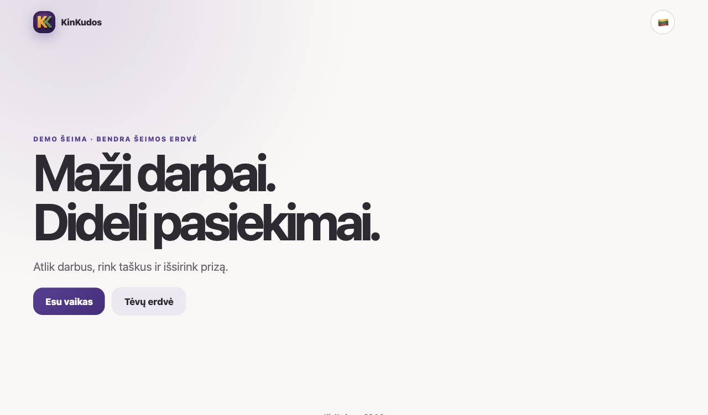
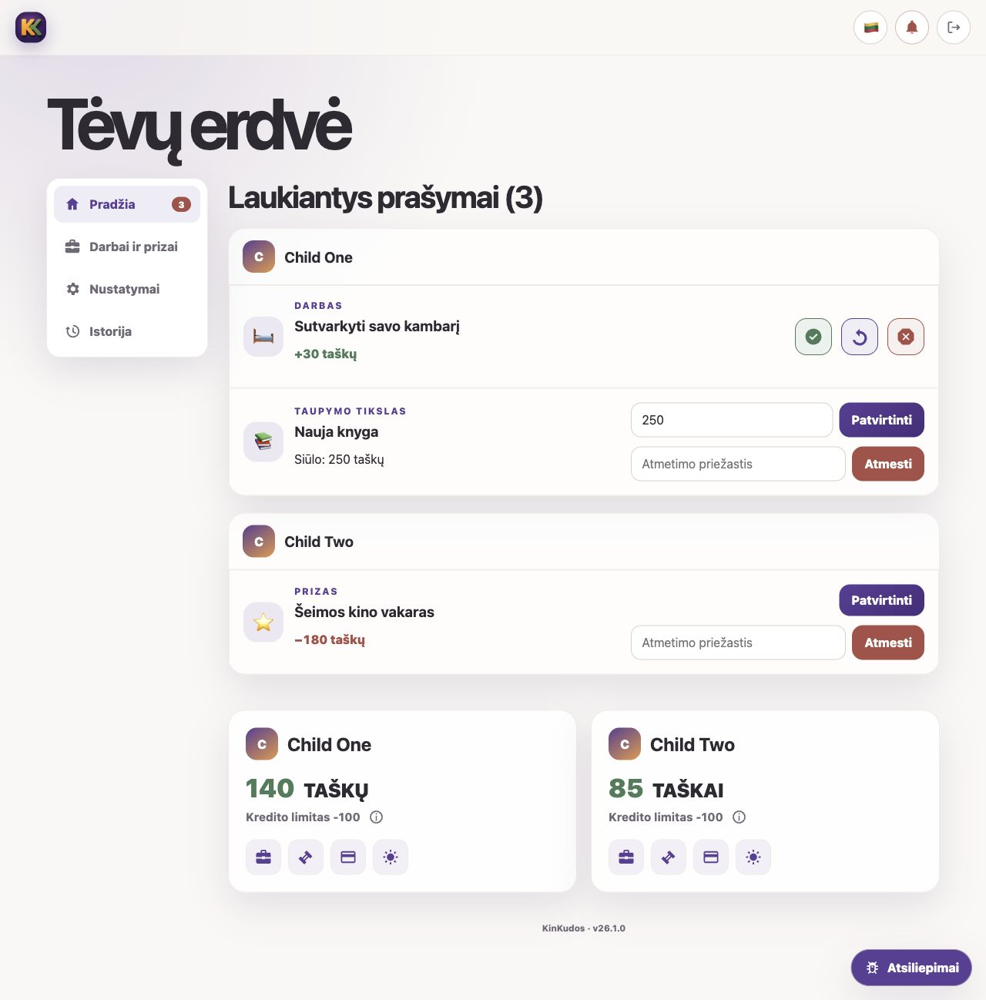
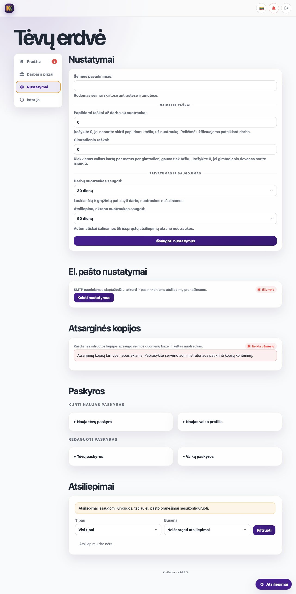
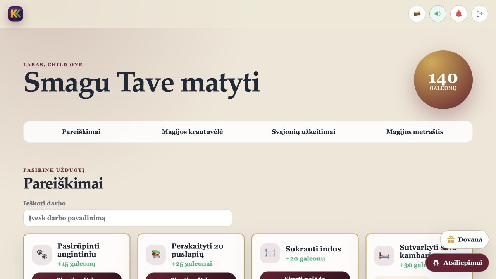
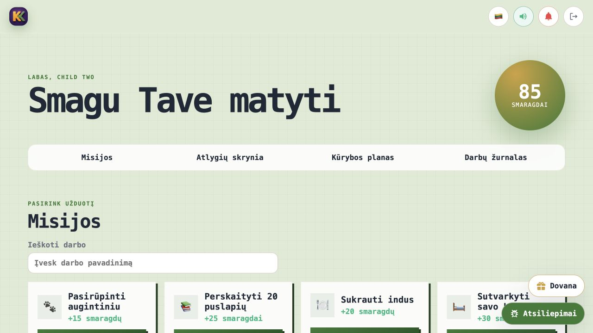

# KinKudos

> A self-hosted family PWA that turns everyday tasks into shared progress.

**Current release:** 26.4.1 · **Languages:** English and Lithuanian<br>
[Lietuviška README versija](README.lt.md)

## Why KinKudos?

KinKudos gives children a clear loop: choose a task, complete it, earn themed
points, and work toward a reward. Parents keep control of approvals, rewards,
penalties, credit limits, and the shared family setup from a phone, tablet, or
desktop browser.

One installation serves one family. The application has no ads or built-in
analytics, and family data stays on the self-hosted server unless an operator
explicitly configures services such as Web Push, SMTP, or encrypted remote
backups.

## A look inside

<table>
  <tr>
    <td width="50%"></td>
    <td width="50%"></td>
  </tr>
  <tr>
    <td align="center"><sub>Simple entry for children and parents</sub></td>
    <td align="center"><sub>Parent overview and approval workflow</sub></td>
  </tr>
</table>

<p>
  
</p>
<p align="center"><sub>Family, privacy, service, account, and feedback settings in one parent workspace</sub></p>

<table>
  <tr>
    <td width="50%"></td>
    <td width="50%"></td>
  </tr>
  <tr>
    <td align="center"><sub>Magic Academy child theme</sub></td>
    <td align="center"><sub>Block World child theme</sub></td>
  </tr>
</table>

The screenshots use fictional demonstration data.

## Highlights

- **Seven child themes** with original visuals, sounds, wording, and point
  units.
- **Parent-controlled family economy** with tasks, approvals, rewards,
  penalties, savings goals, per-child credit limits, gifts, and birthday
  awards.
- **Theme-aware scratch lottery** with transparent win/loss odds, configurable
  earned-point purchases and weekly limits, family and per-child controls,
  persistent tickets, and parent-visible ledger history.
- **Private photo evidence** that is resized, converted to WebP, and stripped
  of EXIF metadata before storage.
- **Installable PWA** with per-device language, sound, and optional Web Push
  controls. The app shell works offline; private balances and requests are not
  cached for offline use.
- **English and Lithuanian interface** throughout the parent and child flows.
- **Encrypted backup integration** for Backblaze B2 or generic S3-compatible
  storage through an isolated `restic` agent, including health and integrity
  reporting.

## Privacy and security model

- Parent accounts use rate-limited passwords. A parent-approved, revocable
  device token is required before a device can see child profiles or enter a
  rate-limited, hashed child PIN.
- Containers run without root privileges and the application container has a
  read-only filesystem.
- Point-changing operations are transactional and the ledger is append-only.
- Uploaded evidence is private and removed according to configurable retention
  periods.
- Credentials, databases, uploads, backups, and family data live outside the
  release source tree.

KinKudos is designed for access through a TLS reverse proxy. Nginx, Caddy,
Traefik, and container-based proxies such as Nginx Proxy Manager are supported.
An optional application-level IP allowlist can restrict child access or the
whole installation. Operators remain responsible for secure hosting, tested
restores, updates, and access to the host itself.

## Deployment

The supported production layout uses a versioned multi-architecture container
image, Docker Compose, SQLite, Gunicorn, an isolated backup agent, and the
operator's chosen TLS reverse proxy. It runs on ARM64 and AMD64 Linux hosts.

- [Installation and upgrades](deploy/README.md)
- [Architecture and security](docs/ARCHITECTURE.md)
- [Release history](CHANGELOG.md)

Release archives and checksums are published on the
[GitHub Releases page](https://github.com/VooZ2/kinkudos/releases), together
with the versioned `ghcr.io/vooz2/kinkudos` container image. The repository
does not publish a one-command public-cloud deployment.

## Local development

Python 3.12 is required. After creating a virtual environment and installing
`requirements.txt`:

```bash
python scripts/compile_translations.py
python manage.py migrate
python manage.py test economy.tests
python manage.py runserver
```

`seed_demo` is development-only and refuses to modify a non-empty database.

## License

Distributed under the [MIT License](LICENSE).

## Disclaimer

KinKudos is an AI-created personal project made solely to experiment with
OpenAI Codex. It is provided as-is, without warranty or a promise of support,
fitness, or security for any particular use.
