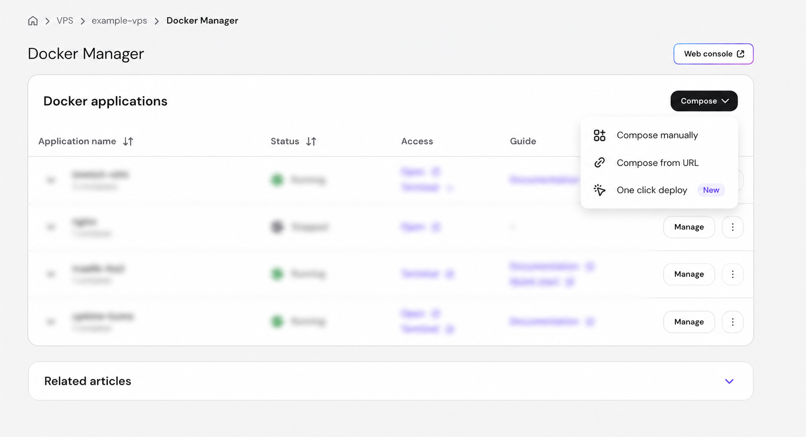
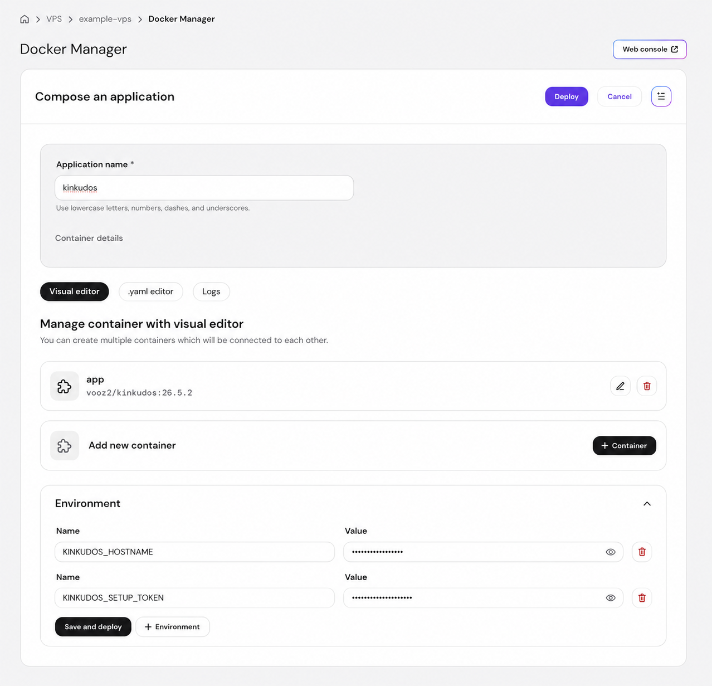
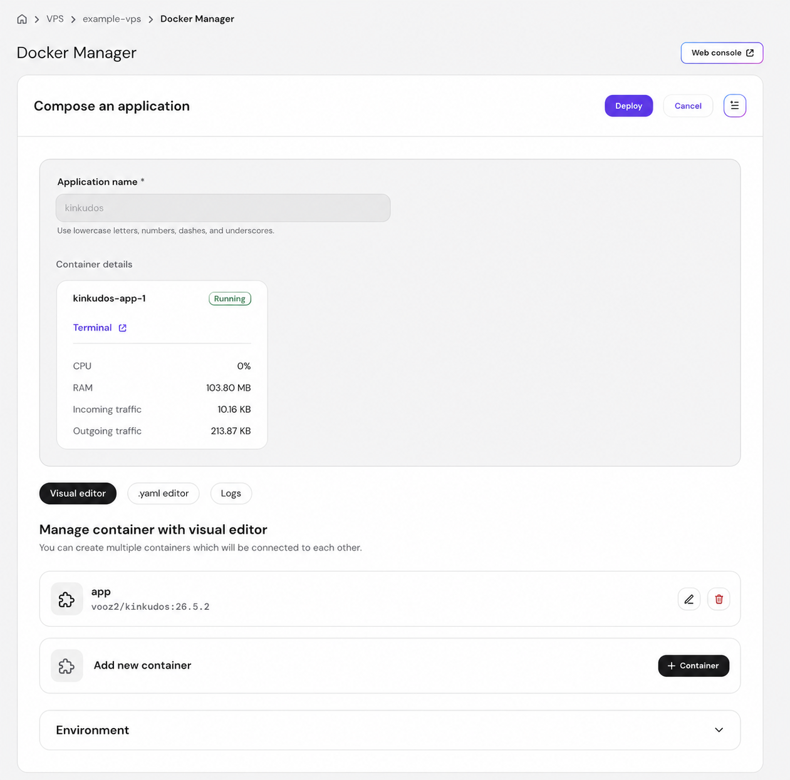

# Įdiekite KinKudos Hostinger VPS serveryje

Tai paprasčiausias palaikomas Hostinger kelias. Naudojamas Hostinger VPS
**Ubuntu 24.04 with Docker** šablonas, Docker Manager, kartu su šiuo šablonu
įdiegtas Traefik atvirkštinis tarpinis serveris ir specialus KinKudos Compose
failas iš `26.5.2` leidimo.

KinKudos Compose aprašas naudoja viešą `vooz2/kinkudos:26.5.2` atvaizdą ir
vieną nuolatinį named volume programos duomenų bazei, medijai bei vykdymo
paslaptims. Hostinger VPS yra mokama, jūsų administruojama paslauga: jūs
atsakote už VPS, domeną, atnaujinimus ir snapshot kopijas.

## 1. Prieš pradėdami

Reikės:

- Hostinger paskyros ir VPS, sukurto iš Hostinger **Ubuntu 24.04 with Docker**
  šablono;
- jūsų valdomo domeno arba subdomeno;
- prieigos prie domeno DNS įrašų;
- VPS viešo IPv4 adreso;
- slaptažodžių tvarkyklės privačiam setup kodui, tėvų prisijungimo duomenims ir kitoms paslaptims saugoti.

KinKudos yra nemokama. Hostinger yra išorinis prieglobos tiekėjas ir nėra
oficialus KinKudos partneris.

[Pradėkite Hostinger](https://www.hostinger.com/vps/docker-hosting?compose_url=https://raw.githubusercontent.com/VooZ2/kinkudos/main/deploy/hostinger/compose.yaml&REFERRALCODE=LKIGEDIMICSU#pricing)

> **Referral pasiūlymas:** Nuoroda gali suteikti nuolaidą ar kitą naudą tinkamoms
> Hostinger paslaugoms, priklausomai nuo tuo metu galiojančio pasiūlymo. Aš taip
> pat galiu gauti komisinį, tačiau Jums tai papildomai nekainuoja. Hostinger nėra
> būtinas KinKudos naudojimui ir nėra oficialus KinKudos partneris.

Nuoroda atveria Hostinger Docker VPS pasirinkimą ir perduoda KinKudos Compose
URL į Docker Manager. Pasirinkę VPS pateikite savo domeną bei privatų setup kodą,
o pirmąjį šeimos nustatymą užbaikite naršyklėje.

## 2. Nukreipkite domeną į VPS

Sukurkite `A` įrašą norimam adresui, pavyzdžiui, `seima.example.com`, ir
nukreipkite jį į VPS viešą IPv4 adresą. Palaukite, kol DNS įrašas atsinaujins.

Docker šablonas Traefik įdiegia automatiškai. Palikite šią Traefik programą
veikiančią ir nekeiskite jos HTTP/HTTPS prievadų. Neviešinkite KinKudos `8000`
prievado tiesiogiai — viešas įėjimas turi būti Traefik.

## 3. Atverkite rankinį Compose redaktorių

Skiltyje **Docker Manager → Applications** atverkite **Compose** ir pasirinkite
**Compose manually**. Nesirinkite **Compose from URL**: šiame lange prieš
sukuriant projektą negalima pateikti KinKudos reikalingų kintamųjų.



Lauke **Application name** įrašykite:

```text
kinkudos
```

Atverkite **.yaml editor**. Visą jo turinį, įskaitant pradinę `services:`
eilutę, pakeiskite tiksliu leidimo failu iš šio adreso:

```text
https://raw.githubusercontent.com/VooZ2/kinkudos/v26.5.2/deploy/hostinger/compose.yaml
```

Tą patį failą galite peržiūrėti
[GitHub](https://github.com/VooZ2/kinkudos/blob/v26.5.2/deploy/hostinger/compose.yaml).
Jame aprašyta `app` paslauga, `vooz2/kinkudos:26.5.2` atvaizdas, Hostinger
Traefik žymos ir named volume `kinkudos-data`.

## 4. Įrašykite dvi privalomas reikšmes

Grįžkite į **Visual editor**, išskleiskite **Environment** ir pridėkite šiuos
du pavadinimus bei reikšmes:

```text
KINKUDOS_HOSTNAME=seima.example.com
KINKUDOS_SETUP_TOKEN=<ilgas-privatus-setup-kodas>
```

Domeną įrašykite be `https://` ir be pasvirojo brūkšnio pabaigoje. Ilgą
atsitiktinį paruošimo kodą sugeneruokite slaptažodžių tvarkyklėje arba komanda:

```bash
openssl rand -hex 32
```

Paruošimo kodą saugokite paslaptyje — jo reikės tik pirmai šeimai ir tėvų
administratoriaus paskyrai sukurti. Nei vienos reikšmės nerodykite ekrano
nuotraukose. Papildomų kintamųjų nepridėkite, nebent turite konkretų palaikomą
konfigūracijos poreikį.



## 5. Paleiskite ir užbaikite nustatymą naršyklėje

Po Environment reikšmėmis paspauskite **Save and deploy**. Palaukite, kol
`kinkudos-app-1` būsena taps **Running**. Tuomet Traefik turėtų nukreipti
domeną, peradresuoti HTTP į HTTPS ir gauti Let's Encrypt sertifikatą.



Atverkite:

```text
https://seima.example.com/setup/
```

Įveskite setup kodą ir naršyklėje sukurkite šeimą bei pirmą tėvų administratorių.
Tada prisijunkite ir patikrinkite, ar atsidaro tėvų skydelis.

## 6. Nuolatiniai duomenys ir priežiūra

Named volume `kinkudos-data` saugo SQLite duomenų bazę, įkeltą mediją ir
vykdymo paslaptis. Konteinerio perkrovimas, Compose priverstinis perkūrimas ir
VPS perkrovimas neturi jo pašalinti. Perkurdami Compose programą neištrinkite
šio volume.

Prieš reikšmingą pakeitimą sukurkite Hostinger VPS snapshot. Snapshot atkuria
visą VPS būseną. Šis kelias realiai patikrintas atliekant švarų diegimą,
HTTPS, pradinį naršyklės nustatymą, duomenų išlikimo, konteinerio ir VPS
perkrovimo, Compose perkūrimo, Docker Manager Update, snapshot sukūrimo ir
snapshot atkūrimo bandymus.

VPS snapshot nėra nešiojama aplikacijos lygio atsarginė kopija visiems
scenarijams. Jei reikia perkeliamumo ar atkūrimo ne Hostinger aplinkoje,
naudokite atskirą patikrintą KinKudos atsarginių kopijų strategiją.

Hostinger Compose faile sąmoningai nėra bendro KinKudos `backup-agent`, Restic
nustatymų ar papildomų kopijų paslapčių. Vėlesnei Hostinger priežiūrai naudokite
Docker Manager palaikomą atnaujinimo veiksmą ir prieš jį sukurkite snapshot.
Nemanykite, kad naujas Compose aprašas ar image tag pritaikomas automatiškai.

Naršyklės nustatymo laukų paaiškinimus rasite [pradinio nustatymo vadove](first-time-setup.lt.md).
