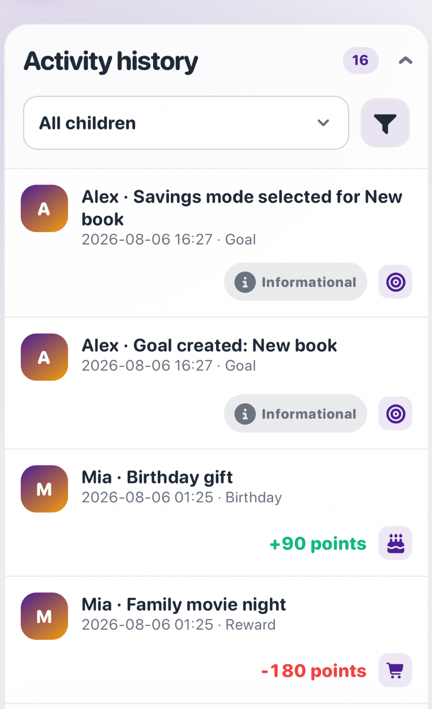

# Activity history and filters

Path: **Parents → History**. History is the family’s readable record of point
changes, decisions, and savings-goal activity. Point transactions cannot be
edited or deleted; a correction creates a new entry.

## What History can include

Depending on what the family uses, History may include:

- approved tasks;
- manually added completed tasks;
- penalties;
- manual positive and negative point adjustments;
- reward purchases;
- reward approvals;
- reward suggestions;
- child-to-child point gifts;
- scratch-ticket purchases;
- scratch-ticket results and prizes;
- birthday points;
- goal creation;
- savings-method selection;
- points moved into a goal;
- points returned from a goal;
- Current goal changes;
- a goal reaching its target;
- a goal being completed;
- a goal being deleted and saved points returned;
- existing automatic balance events.

Rejected task and reward decisions can also appear as decision records, even
when no points moved.

## Child selector

The child selector is separate from the advanced filter dialog. Selecting a
child filters History immediately; there is no need to open **Filters** or
press another **Apply** action merely to switch children. Other active query
filters remain in place.

View Parent activity History on mobile

The screenshot uses fictional demonstration data.

## Advanced filters

Open **Filters** when you need more control. You can choose:

- an activity type, such as Tasks, Penalties, Rewards, Goals, Gifts, Scratch
  tickets, or Point adjustments;
- a date range: This week, Any time, This month, or Custom range;
- From and To dates for a custom range.

The **Filters** control shows the active-filter count when filters are set.
Active filters also appear as removable chips. Use **Reset** to clear the
advanced choices and **Apply** to submit them.

History rows do not use a calendar icon beside every date. Activity icons and
their responsive positions are visual aids; the readable action name and row
text are the source of meaning.

## Status and value meaning

- **Approved** uses the success treatment.
- **Informational** is neutral and muted; an informational entry may have no
  point value.
- Positive point changes are green.
- Negative point changes are red.

The main themed child balance uses the child’s selected world. The green and
red point-change colors described here apply to History and other logs.

See also [Points, penalties, and corrections](points-and-corrections.md),
[Rewards, goals, and scratch tickets](rewards-goals-and-lottery.md), and
[Savings goals and suggestions](savings-goals.md).

[Parent dashboard and child cards →](dashboard-and-child-cards.md) · [Lietuviškai](history.lt.md)
