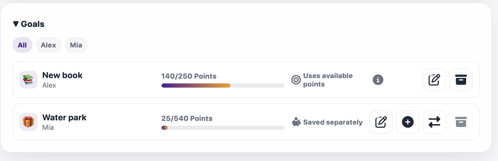

# Savings goals and child suggestions

A child can have several active savings goals. Each active goal uses one saving
method: **Use available points** or **Save separately**. The method is chosen
for the goal, not as a global Settings option.

> **For:** Parents and children 
> **Result:** A visible goal with an honest explanation of what its progress
> means

## Suggest a goal

In the child space, choose **Suggest a reward or goal**, select **Savings goal**,
and enter a title, suggested amount, and optional emoji. The saving method is
chosen after the parent approves the proposal: the new goal shows **Choose
mode**, which opens **Choose how to save**, where the child selects one of
these methods:

- **Use available points**;
- **Save separately**.

The proposal itself does not reserve points or carry a saving method. If the
child chooses **Use available points** for a goal while another goal is the
**Current goal**, the new choice becomes the current designation. This does not
move points or create a balance transaction.

The proposal appears under **Parents → Home → Pending requests**. The parent
chooses the final amount; it does not have to match the suggestion. Approving a
reward proposal creates a shared reward, while approving a goal proposal
creates that child’s personal goal. Rejecting a proposal requires a reason and
does not change the balance.

## Use available points

The child-facing statuses can include **Current goal** and **Uses available
points**.

- The child’s positive spendable balance counts as progress.
- Those points remain available for rewards.
- Buying a reward or making another point change can reduce the progress.
- Credit does not count as progress.
- A zero or negative balance gives zero progress.
- Only one active goal per child can use available points at a time.
- Changing the **Current goal** only changes which goal follows the balance;
  it does not move points or create a ledger transaction.

The parent sees the same method as **Uses available points** in **Manage →
Goals**. An information popover explains that the points can still be spent and
the progress may go down.

## Save separately

The child-facing statuses can include **Saved** and **Saved separately**.

- The child moves a selected amount from the available positive balance into
  the goal.
- The spendable balance decreases.
- Saved points can no longer be used for rewards.
- Credit cannot be moved into a goal.
- The amount cannot exceed the positive spendable balance.
- The amount cannot exceed what is still needed to reach the target.
- Saved points remain linked to that specific goal.

The parent sees **Saved separately** in **Manage → Goals**. The saved amount is
also included in the child-card saved total.

## Add points

For a saved goal, choose **Add points**. The dialog shows **Available balance**
and offers the quick choices `10`, `25`, `50`, and **All**, plus **Custom
amount**.

The **After** preview shows the goal’s saved total after the selected amount is
added; the available balance is shown separately. **All** is capped by both the
available positive points and the amount still needed for the target. The child
UI uses the selected theme’s point-unit name.

## Parent management

Go to **Parents → Manage → Goals**. The section provides:

- a child filter;
- the goal’s **Current goal** or **Saved separately** method;
- current progress and target with a progress bar;
- **Edit**;
- **Add points** for a saved goal;
- **Move saved points back**;
- **Delete**.

Returning saved points creates a positive spendable History entry. A saved
goal’s points can be returned before changing its method or closing it.

The screenshot uses fictional demonstration data.

## Delete

Use the text action **Delete** and confirm the choice.

- A goal with no separately saved points is removed from active use.
- A goal with saved points returns those points to the child’s spendable
  balance before removal.
- Deleting a **Current goal** clears that designation without moving points.
- Pending goal-completion requests are cancelled.
- **History** remains available, including the deletion and any returned
  points. Historical records are not erased even though the goal is no longer
  active.

## Complete a goal

The child can request completion after the goal reaches its target. Completion
goes to **Parents → Home → Pending requests** for parent approval.

### Available-points goal

The child reaches the target using the current positive spendable balance.
Points are not spent when the request is sent. When the parent approves,
KinKudos checks the balance again. If it became too low, completion cannot
proceed until enough points are available again. Approval deducts the target
once.

### Separately saved goal

The saved points reach the target. Parent approval consumes that saved
allocation, and the spendable balance is not deducted again.

If the goal no longer reaches its target by the time of approval, the parent
receives a validation error instead of a partial completion.

## Existing goals after updating

The 26.6.0 migration assigns **Use available points** to an existing child’s
only active goal. If a child already has several active goals, none is selected
automatically; the child is asked to choose a saving method. This avoids
guessing which old goal should become the Current goal.

[Activity history and filters →](history.md) · [Rewards, goals, and scratch tickets →](rewards-goals-and-lottery.md) · [Child space →](child-space.md) · [Lietuviškai](savings-goals.lt.md)
