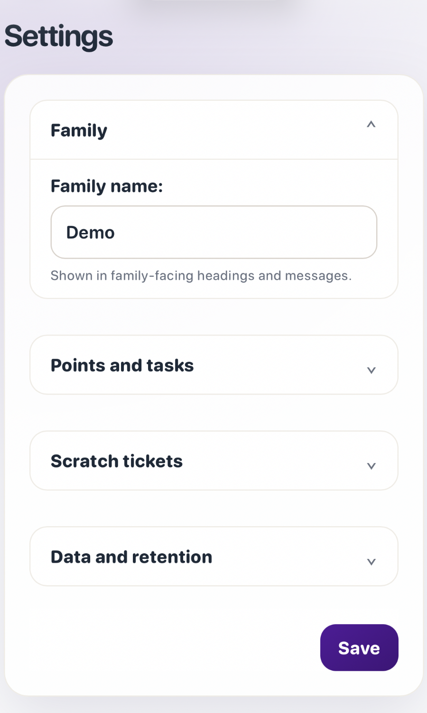

# Tėvų nustatymai

Kelias: **Tėvai → Nustatymai**. Puslapis suskirstytas į tas pačias grupes kaip
programoje. Telefone grupės yra kompaktiškos išskleidžiamos skiltys: pasirinkus
atsiveria laukai, o tuščios skiltys nerodomos. Plačiame ekrane susietų paskyrų
kortelės gali būti dviejuose stulpeliuose, o didelės paslaugų ir saugumo sritys
lieka per visą plotį.

> **Kas gali ką keisti?** Visi tėvai gali naudoti įprastus šeimos nustatymus ir
> tvarkyti paskyras. Tėvų administratorius vienintelis gali keisti tinklo
> prieigą, SMTP, kopijų duomenis, paleisti kopiją ir atšaukti visus vaikų
> įrenginius.

Peržiūrėti angliškus tėvų nustatymus telefone

Ekrano nuotraukoje naudojami tik išgalvoti demonstraciniai duomenys.

## Šeima

### Šeimos pavadinimas

**Šeimos pavadinimas** rodomas šeimai skirtose antraštėse ir žinutėse. Jis
keičia tik rodomą pavadinimą, o ne paskyrų vardus, domeną ar prieigą.

## Taškai ir darbai

Šios reikšmės taikomos būsimiems veiksmams ir neperrašo užbaigtų darbų ar
esamų **Istorijos** įrašų.

| Laukelis | Reikšmė |
| --- | --- |
| **Taškai už darbo nuotrauką** | Papildomi taškai, kai vaikas pateikia darbą su nuotrauka. `0` išjungia priedą. Reikšmė užfiksuojama pateikimo metu. |
| **Gimtadienio taškai** | Kartą per metus skiriama dovana pagal išsaugotą vaiko gimtadienį. `0` išjungia. Tais pačiais kalendoriniais metais tas pats vaikas neapdovanojamas du kartus. |

## Nutrinami bilietai

Šie šeimos valdikliai veikia kartu su individualiu jungikliu skiltyje
**Paskyros → Vaikų profiliai**:

| Laukelis | Reikšmė |
| --- | --- |
| **Įjungti nutrinamus bilietus** | Bendras jungiklis. Išjungus sustoja nauji pirkimai ir priminimai, bet pradėtą bilietą galima baigti. |
| **Nutrinamo bilieto kaina** | Būsimų bilietų kaina taškais. Jau nupirktas bilietas išlaiko užrašytą kainą. |
| **Savaitinis bilietų limitas** | Kiek vienas vaikas gali pirkti nuo pirmadienio iki sekmadienio. Skaitiklis atsinaujina pirmadienį. |

Nutrinami bilietai pasirenkami; jie nebūtini įprastiems darbams ar prizams.

## Duomenys ir saugojimas

Šie laukai valdo automatinį įkeltų vaizdų šalinimą, o ne paskyrų istorijos ar
taškų įrašų trynimą.

| Laukelis | Reikšmė |
| --- | --- |
| **Saugoti darbų nuotraukas** | Užbaigtų darbų nuotraukų saugojimas: neribotai, 7, 30 arba 90 dienų. Laukiančios ar taisyti grąžintos nuotraukos automatiškai netrinamos. |
| **Saugoti atsiliepimų nuotraukas** | Išspręsto atsiliepimo ekrano nuotraukos saugojimas. Neišspręstų atsiliepimų nuotraukos automatiškai netrinamos. |

## Vaikai ir prieiga

### Vaikų įrenginiai

Tik susietas įrenginys gali rodyti vaikų profilius arba priimti vaiko PIN.
Profilis saugo vaiko taisykles ir Istoriją, o įrenginys yra naršyklė,
telefonas, planšetė ar PWA, kuriai leista tuo profiliu naudotis.

| Valdiklis | Rezultatas |
| --- | --- |
| **Įrenginio pavadinimas** | Pavadina įrenginį prieš susiejant, pvz., „Virtuvės planšetė“. |
| **Leisti vaikams naudoti šį įrenginį** | Iškart susieja dabartinę naršyklę/PWA. Tada galima pasirinkti vaiką ir įvesti PIN. |
| **Sukurti privačią susiejimo nuorodą** | Sukuria vienkartinę nuorodą, galiojančią **10 minučių**. Atidarykite tik numatytame įrenginyje. |
| **Pervadinti** | Pakeičia tik įrenginio pavadinimą. |
| **Atšaukti** | Pašalina vaiko prieigą ir pranešimus iš vieno prarasto ar nebenaudojamo įrenginio. Norint prisijungti reikės susieti iš naujo. |
| **Atšaukti visus vaikų įrenginius** | Tik administratoriui. Reikia jo slaptažodžio ir visus įrenginius teks susieti iš naujo. |

Prieš naudodami privačią nuorodą perskaitykite [vaiko įrenginio susiejimo
vadovą](../start/pair-a-child-device.lt.md).

### Tinklas ir saugumas

Tinklo prieiga yra pasirenkamas papildomas saugumo sluoksnis. Tėvų slaptažodžiai,
vaikų PIN ir įrenginių susiejimas veikia ir išjungus IP ribojimus.

| Režimas | Ką leidžia |
| --- | --- |
| **Prieiga iš interneto** | Jokio IP ribojimo. |
| **Riboti vaikų prieigą** | Vaikų puslapiai veikia tik iš įrašytų IP adresų ar tinklų; tėvų puslapiai IP neribojami. |
| **Riboti visą prieigą** | Vaikų ir tėvų puslapiai veikia tik iš įrašytų IP adresų ar tinklų. |

Į **Leidžiamus IP adresus ir tinklus** rašykite po vieną IPv4, IPv6 ar CIDR
tinklą eilutėje, pvz., `192.0.2.25`, `192.0.2.0/24` arba `2001:db8::/64`.
Prieš pasirinkdami **Riboti visą prieigą** įrašykite puslapyje rodomą dabartinį
IP. Neteisinga taisyklė gali užrakinti visus ir reikės serverio administratoriaus.

## El. paštas ir pranešimai

SMTP pasirenkamas. Jis naudojamas tėvų slaptažodžiui atkurti ir, nustačius
gavėją, privačių atsiliepimų pranešimams. Atsiliepimas išlieka KinKudos, net jei
el. paštas išjungtas. Naršyklės ar PWA pranešimai įjungiami prisijungusio ekrano
pranešimų valdikliu; „iPhone“ ir „iPad“ pirmiausia reikia įdiegti KinKudos į
pradžios ekraną.

Įjungus el. paštą rodomas SMTP serveris, siuntėjo adresas ir atsiliepimų gavėjas,
bet ne slaptažodis. **Keisti nustatymus** reikalauja administratoriaus tėvų
slaptažodžio, o SMTP slaptažodį kiekvieną kartą reikia įvesti iš naujo.

| Laukelis | Ką įrašyti |
| --- | --- |
| **Įjungti el. paštą** | Įjungti arba išjungti laiškų siuntimą. |
| **SMTP serveris** | Tiekėjo siunčiamų laiškų serverio vardą, pvz., `smtp.example.com`. |
| **SMTP prievadas** | Tiekėjo prievadą, dažnai 587 STARTTLS arba 465 SSL/TLS. |
| **Šifravimas** | `STARTTLS`, `SSL/TLS` arba `None`; `None` tik patikimam privačiam relay. |
| **SMTP naudotojo vardas** | Pašto paslaugos prisijungimo vardą. |
| **SMTP slaptažodis** | Pašto ar programėlės slaptažodį; po išsaugojimo jis nerodomas. |
| **Siuntėjo el. pašto adresas** | Adresą, kurį matys gavėjai. |
| **Atsiliepimų gavėjo el. pašto adresas** | Adresą, kuriuo siunčiami papildomi pranešimai. |
| **Jūsų paskyros slaptažodis** | Dabartinį administratoriaus slaptažodį jautriems pakeitimams apsaugoti. |

## Atsarginės kopijos

Kopijų paslauga kasdien sukuria šifruotas nuotolines šeimos duomenų bazės ir
įkeltų nuotraukų kopijas. Atkūrimas nėra mygtukas internete – tai serverio
administratoriaus veiksmas.

Būsena gali būti **Įjungta**, **Kopijuojama**, **Neįjungta** arba **Reikia
dėmesio**. Skydelyje taip pat rodomas tiekėjas, saugykla, **Paskutinė sėkminga
kopija**, **Paskutinė vientisumo patikra**, klaidos ir naujausi kopijų veiksmai.

**Kurti kopiją dabar** paprašo papildomos kopijos; ji neatkuria duomenų ir
nepaleidžiama, kol kita kopija vyksta. Prieš keisdami duomenis išsaugokite repo
slaptažodį ne serveryje ir suplanuokite atkūrimo bandymą.

| Laukelis | Ką įrašyti |
| --- | --- |
| **Saugyklos tiekėjas** | „Backblaze B2“ (rekomenduojama) arba kitą su S3 suderinamą tiekėją. |
| **S3 endpoint** | Tiekėjo S3 API hostą be `https://` ir galinio `/`. |
| **Bucket pavadinimas** | Atskirą KinKudos kopijoms skirtą bucket. |
| **Regionas** | Tiekėjo regioną, jei jis reikalingas. |
| **Application key ID / Application key** | Prisijungimo duomenis, geriausia apribotus šiam bucket. |
| **Jūsų paskyros slaptažodis** | Dabartinį administratoriaus slaptažodį. |

Ryšys patikrinamas prieš išsaugojimą. Tiekėjo duomenys laikomi atskiruose
apsaugotuose serverio failuose. Žalia būsena nepakeičia bandomojo atkūrimo.

## Paskyros

### Tėvų paskyros

Kiekvienam suaugusiajam sukurkite atskirą tėvų paskyrą su naudotojo vardu, el.
paštu ir stipriu slaptažodžiu. Redaguokite naudotojo vardą, el. paštą ar
slaptažodį; tušti naujo slaptažodžio laukai palieka senąjį.

Pašalinus tėvą paskyra išjungiama, o jos Istorija lieka. Paskutinio aktyvaus
tėvo išjungti negalima.

### Vaikų profiliai

Kurdami profilį nustatykite vaiko vardą, pasirenkamą lietuvišką kreipinį,
pradinį PIN, kreditą, individualų nutrinamų bilietų jungiklį ir gimtadienį.
Pirmą kartą prisijungęs vaikas pasirenka temą.

| Laukelis | Kas pasikeičia |
| --- | --- |
| **Vaiko vardas** | Rodomas vardas; vardai turi būti unikalūs. |
| **Kreipinys** | Pasirenkamas lietuviškas pasisveikinimo variantas. |
| **Kreditas** | Žemiausias leidžiamas balansas, pvz., `-100`; ta pati taisyklė rodoma vaiko kortelėje. |
| **Įjungti nutrinamus bilietus šiam vaikui** | Individualus leidimas; bendras šeimos jungiklis taip pat turi būti įjungtas. |
| **Gimtadienis** | Kasmetinių gimtadienio taškų taisyklė. Tėvai gali redaguoti tiesiogiai, o vaiko prašymui reikia patvirtinimo. |
| **Naujas PIN / Pakartokite naują PIN** | Iš naujo nustato keturių skaitmenų PIN. Abu tušti laukai jo nekeičia. |

Pašalinus vaiką profilis išjungiamas, o jo Istorija lieka. Duomenys kitam vaikui
neperduodami.

## Šeimos atsiliepimai

Tėvai ir vaikai gali programoje pateikti privatų **pasiūlymą** arba **problemos**
pranešimą. Jis lieka šiame serveryje; sukonfigūravus SMTP galima siųsti ir
pranešimą pasirinktam gavėjui.

Naudokite **Tipo** ir **Būsenos** filtrus. **Naujas** dar neperžiūrėtas,
**Peržiūrėtas** perskaitytas, **Planuojamas** reiškia numatomą šeimos veiksmą,
o **Išspręstas** – kad papildomų veiksmų nebesitikima. Atidarykite įrašą,
perskaitykite aprašą, peržiūrėkite pasirenkamą nuotrauką ir išsaugokite būseną.

KinKudos išsaugo pateikusiojo vaidmenį ir vardą, puslapio kelią, programos
versiją, kalbą, temą ir naršyklės/įrenginio aprašą. Tai lieka šeimos diegime ir
į GitHub nesiunčiama. Ekrano nuotraukoms taikoma aukščiau nurodyta saugojimo
taisyklė.

## Nuotraukų ribos ir laiko taisyklės

Darbo nuotraukos ir atsiliepimų ekrano nuotraukos priima JPEG, PNG, WebP, HEIC
arba HEIF iki **12 MB**. Avatarai priima tuos pačius formatus iki **5 MB** ir
apkerpami į kvadratą.

Paskirti dienos darbai baigiasi vidurnaktį pagal **vietinį serverio laiką**.
Nutrinamų bilietų limitai atsinaujina kiekvieną pirmadienį tame pačiame
kalendoriniame kontekste.

[Tinklo prieiga →](../security/network-access.lt.md) · [Atsarginės kopijos →](../backups.lt.md) · [Šeimos administravimas →](../family-administration.lt.md) · [English](settings.md)
